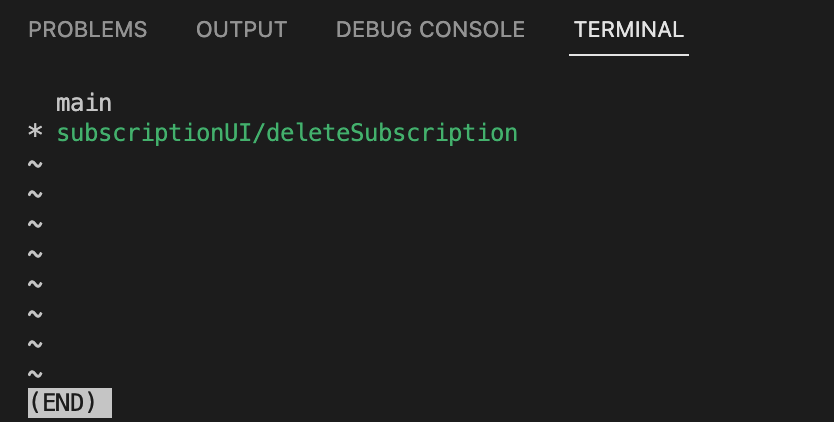

# Git Commands

## 1. Summary of git commands table:

<table>
  <tr>
    <th>Command</th>
    <th>Options</th>
    <th>Description</th>
    <th>Notes</th>
  </tr>
  <tr>
    <td rowspan="3">git init</td>
    <td></td>
    <td>Transform the current directory<br>
      into a git repository</td>
    <td rowspan="4">init vs. clone:<br>
      Use init when starting a new repository<br>
      locally, use git clone when<br>
      remote repository already exists<br>
      <a href="https://github.com/git-guides/git-init">doc: init vs clone</a></td>
  </tr>
  <tr>
    <td>&lt;directory&gt;</td>
    <td>Create a new git repository<br>
      in the specified directory</td>
  </tr>
  <tr>
    <td>--bare</td>
    <td></td>
  </tr>
  <tr>
    <td>git clone</td>
    <td>&lt;url&gt;</td>
    <td>Clone a remote repository to local</td>
  </tr>
  <tr>
    <td>git branch</td>
    <td>&lt;branch name&gt;</td>
    <td>Create a new branch, stay on current branch</td>
    <td rowspan="6">branch vs. checkout vs. switch:<br>
      git checkout = git swtich<br>
      git checkout -b = git switch -c<br>
      git checkout -b = git branch + git checkout
      <a href="https://www.cnblogs.com/tinywan/p/12344267.html">doc: checkout vs switch</a><td>
  </tr>
  <tr>
    <td rowspan="2">git checkout</td>
    <td>&lt;existing branch name&gt;</td>
    <td>Redirect to the existing branch</td>
  </tr>
  <tr>
    <td>-b &lt;new branch name&gt;</td>
    <td>Create and redirect to the new branch</td>
  </tr>
  <tr>
    <td rowspan="2">git switch</td>
    <td>&lt;existing branch name&gt;</td>
    <td></td>
    <td></td>
  </tr>
  <tr>
    <td>-c &lt;new branch name&gt;</td>
    <td>Create and redirect to the new branch</td>
    <td></td>
  </tr>
  <tr>
    <td>git restore</td>
    <td></td>
    <td></td>
    <td></td>
  <tr>
    <td>git fetch</td>
    <td></td>
    <td>When no remote is specified, by default the `origin` remote will be used, unless there’s an upstream branch configured for the current branch.</td>
    <td rowspan="3">`git fetch` asks git if the remote has any updates that the local work directory doesn't have. It does not involve in file transferring from remote to local git work repository.
- `git pull` pull remote changes if there are any. `git pull` command involve in file transferring from remote repo to local git repository</td>
  </tr>
  <tr>
    <td>git merge</td>
    <td></td>
    <td>usually merge origin/main branch to local main branch.Confirm message is 'Already up to date.'</td>
    <td></td>
  </tr>
  <tr>
    <td>git pull</td>
    <td></td>
    <td></td>
    <td></td>
  </tr>
</table>


----
## 2. Problems and Solutions

### 2.1 check local git repo
When error with initializing git repository, you may suspect that another parent directory is also a Git repository. To fix this, check if there is a `.git` folder in the other directory, using `git status` or ```ls -al```. Then remove the `.git` folder using `rm -rf .git` or `rm -rf .git*`.

### 2.2 git branch return weird outcome
- `git branch` gives some weird outcome, as shown in the image below:
  - 
  - The problem probaly lies in Oh My Zsh. When you see this outcome, you can exit by typing `q`
  - We can instead use `git -P branch`, which will give the expected outcome
  - or people says `git config --global core.pager cat` can solve the problem
  - lets try above two options in working environment
