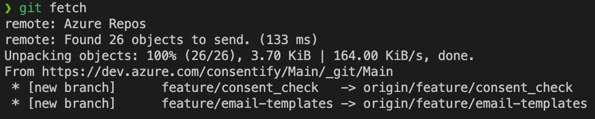
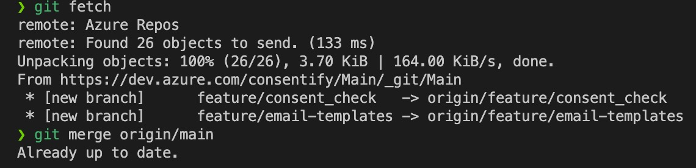

# Git Commands

----
## **1. git init, git clone**
ducumentation for git init [here](https://github.com/git-guides/git-init) and [here](https://git-scm.com/docs/git-init)

### 1.1 git init vs git clone

|       | git init | git clone |
| ----- | -------- | --------- |
| usage | start a new repository locally | remote repository already exists |
| command | `git init` | `git clone <url>` |

**git init**
- Options:
  - `git init`: transform the current directory into a git repository
  - `git init <directory>`: create a new git repository in the specified directory
  - `git init --bare`: N/A
- Steps:
  - initialize the repository
  - create a remote repository somewhere like GitHub.com
  - add the remote URL to your local git repository with `git remote add origin <url>` 
  - shape your history into at least one commit by using `git add` to stage the existing files, and `git commit` to make the snapshot
  - push to the remote and set up the tracking relationship for good with `git push -u origin master`
  ```bash
  git init
  git add README.md
  git commit -m "first commit"
  git branch -M main
  git remote add origin https://github.com/Kugelbrecher/fondren-fellow.git
  git push -u origin main
  ```

**git clone**

### 1.2 **Issues**
- When error with initializing git repository, you may suspect that another parent directory is also a Git repository. To fix this, check if there is a `.git` folder in the other directory, using `git status` or ```ls -al```. Then remove the `.git` folder using `rm -rf .git` or `rm -rf .git*`.


----
## 2. **git branch, git checkout**
documentation for git branch [here](https://git-scm.com/docs/git-branch), git checkout


----
## 3. [git fetch](https://git-scm.com/docs/git-fetch), [git merge](https://git-scm.com/docs/git-merge), [git pull](https://git-scm.com/docs/git-pull)

Fetch: 
- When no remote is specified, by default the `origin` remote will be used, unless there’s an upstream branch configured for the current branch.
- Q: why fatal error when `git fetch origin/main` to local main branch? (fatal: 'origin/main' does not appear to be a git repository fatal: Could not read from remote repository.)
- 

Merge: 
- usually merge origin/main branch to local main branch. 
- Confirm message is 'Already up to date.'
- 

Difference between `git fetch` and `git pull`:
- `git fetch` asks git if the remote has any updates that the local work directory doesn't have. It does not involve in file transferring from remote to local git work repository.
- `git pull` pull remote changes if there are any. `git pull` command involve in file transferring from remote repo to local git repository